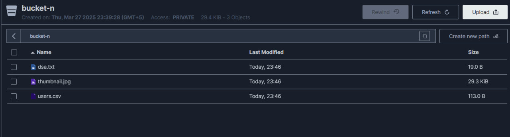

# Отчет по выполненной работы: PostgreSQL + S3-хранилище в Docker-Compose

В этом документе описаны шаги выполненные для развертывания PostgreSQL, MinIO и pgAdmin с использованием Docker Compose, а также автоматизация загрузки данных в PostgreSQL и MinIO.

## 1. Изучение задания и инструментов

### 1.1 Постановка задачи

Перед началом ознакомился с заданием и изучил необходимые инструменты, которые нужно развернуть.
- PostgreSQL с автоматическим созданием и инициализацией таблиц с помощью SQL-скриптов.
- S3-хранилище — в данном случае MinIO.
- pgAdmin для работы с PostgreSQL.
- SQL-скрипты для автоматической загрузки CSV файлов в PostgreSQL и файлов в MinIO.

### 1.2 Источники

Для развертывания использовался Docker Compose. Образы были взяты из официальных репозиториев:

- Docker Hub: [https://hub.docker.com/](https://hub.docker.com/)
- PostgreSQL на Docker Hub: [https://hub.docker.com/_/postgres](https://hub.docker.com/_/postgres)
- pgAdmin на Docker Hub: [https://hub.docker.com/r/dpage/pgadmin4](https://hub.docker.com/r/dpage/pgadmin4)

## 2. Разработка инфраструктуры

### 2.1 Создание файла ``.env``

Для хранения конфиденциальных данных, таких как логины и пароли, был создан файл `.env`. Этот файл используется для задания переменных окружения.

```env
POSTGRES_USER=admin
POSTGRES_PASSWORD=admin
POSTGRES_DB=db
POSTGRES_HOST=localhost
POSTGRES_PORT=5432

CSV_USERS=data/users.csv
CSV_ORDERS=data/orders.csv

MINIO_ROOT_USER=minioadmin
MINIO_ROOT_PASSWORD=minioadmin
MINIO_ENDPOINT=http://localhost:9000
BUCKET_NAME=bucket-n
FILES_DIR=s3data

PGADMIN_DEFAULT_EMAIL=admin@admin.com
PGADMIN_DEFAULT_PASSWORD=admin
```
### 2.2 Создание `docker-compose.yml`
 `docker-compose.yml` файл предназначен для развертывания трех сервисов с использованием Docker Compose
 ```
services:
  postgres:
    image: postgres:13
    container_name: postgres
    environment:
      POSTGRES_USER: ${POSTGRES_USER}
      POSTGRES_PASSWORD: ${POSTGRES_PASSWORD}
      POSTGRES_DB: ${POSTGRES_DB}
    volumes:
      - ./pgdata:/var/lib/postgresql/data
      - ./init.sql:/docker-entrypoint-initdb.d/init.sql
    ports:
      - "5432:5432"

  minio:
    image: minio/minio
    container_name: minio
    command: server /data --console-address ":9001"
    environment:
      MINIO_ROOT_USER: ${MINIO_ROOT_USER}
      MINIO_ROOT_PASSWORD: ${MINIO_ROOT_PASSWORD}
    volumes:
      - ./s3data:/data
    ports:
      - "9000:9000"
      - "9001:9001"

  pgadmin:
    image: dpage/pgadmin4
    container_name: pgadmin
    environment:
      PGADMIN_DEFAULT_EMAIL: ${PGADMIN_DEFAULT_EMAIL}
      PGADMIN_DEFAULT_PASSWORD: ${PGADMIN_DEFAULT_PASSWORD}
    ports:
      - "5050:80"
 ```
## 3. Развертывание и запуск
### 3.1. Запуск контейнеров:
Запустил контейнеры и проверил их состояние:

```
docker-compose up -d
docker ps
```


## 4. Автоматизация работы с базой данных
### 4.1. Загрузка CSV-файла в PostgreSQL:
Написал скрипт load_postgres.py, который считывает CSV-файлы из папки data и загружает их в базу данных PostgreSql.
```
python scripts/load_to_postgres.py
```
### 4.2. pgAdmin:
Заходим в pgAdmin по ссылке http://localhost:5050. Проверим наши таблицы на создание и заполнение.


### 4.3. MinIO
Заходим в MInIO по ссылке http://localhost:9000. Создаем bucket вручную, указываем название которое было описано в файле `.env`, а именно `BUCKET_NAME=bucket-n`. Запускаем наш скрипт upload_s3.py для загрузки  файлов в MinIO и проверям.
```
python scripts/uploads3.py
```



## 5. Итоги
- В результате была развернута интегрированная среда с использованием PostgreSQL, MinIO и pgAdmin, настроенная с помощью Docker Compose. 

- С помощью Python-скриптов данные успешно загружены в PostgreSQL и MinIO, что позволяет эффективно управлять и обрабатывать данные в рамках lab1.


