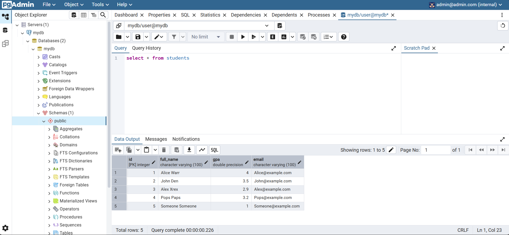
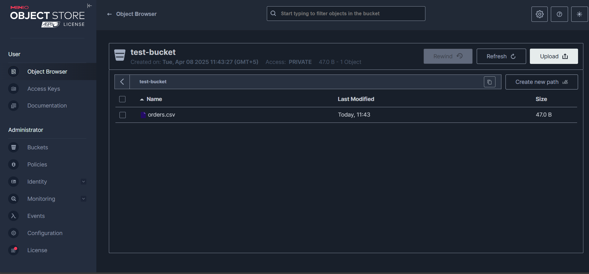

# Hello to my lab1

### Here are the tools used to build the project

#### Used to build(libraries)
- libpqxx - C++ main library for working with PostgreSQL
- AWS SDK - Library to work with s3 Data clouds, in this lab it is Minio

#### Used to configure
- Previously used ***g++ compiler*** downloaded from MSYS2, became inefficient when it came to complex work with AWS SDK, so this time I replaced it with ***CMake***
- ***vcpkg*** was used to download all the necessary dependencies for the project

## It is important for this build to run, at least for now, the requirements include:
- [ CMake ](https://cmake.org/download/)
- [ vcpkg ](https://github.com/microsoft/vcpkg) git cloned
- libpqxx and aws sdk downloaded

## Walkthrough the project
```
docker-compose up -d
```
Will set up the PostgreSQL and Minio, after that if you use windows opening the ***cpp_scripts*** and running:
```
run.bat
```
Will automatically build CMake and run the scripts

### Results

after running the scripts and opening localhost 80 PGAdmin, the database is successfully set and after running basic script the result is following



then, comming to Minio and opening localhost 9001 the result is following

