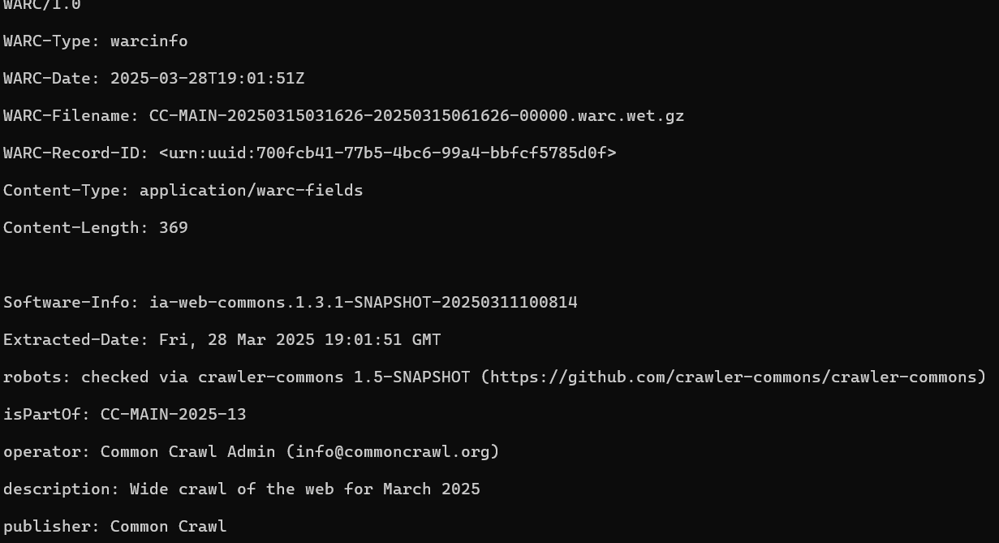
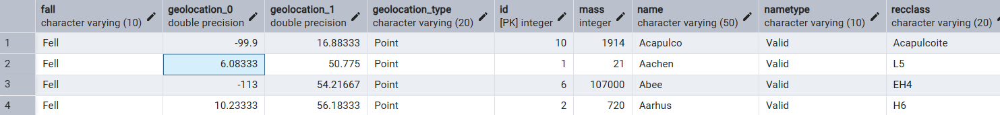
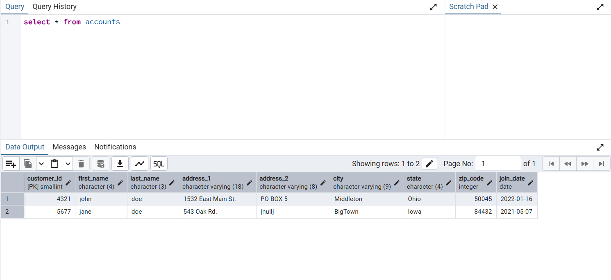
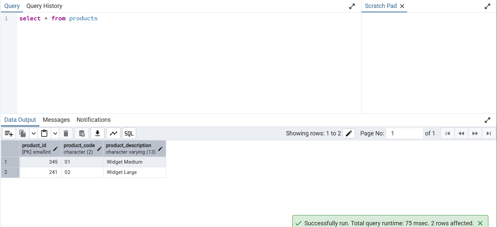
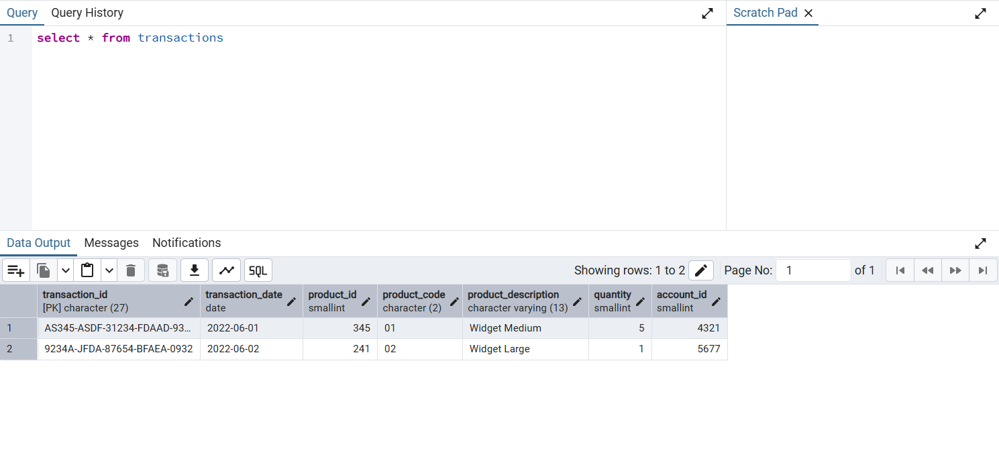

# Welcome to my lab2 work

### Exercize 3

There is everything used to achieve what was mentioned in exercize 3 of the ***data-engineering***

Generally, your script should do the following ...

1. boto3 download the file from s3 located at bucket commoncrawl and key crawl-data/CC-MAIN-2022-05/wet.paths.gz
2. Extract and open this file with Python (hint, it's just text).
3. Pull the uri from the first line of this file.
4. Again, download the that uri file from s3 using boto3 again.
5. Print each line, iterate to stdout/command line/terminal.

Extra Credit:

1. DO NOT load the entire final file into memory before printing each line, stream the file.

2. DO NOT download the initial gz file onto disk, download, extract, and read it in memory.

#### This task was achieved ***WITHOUT*** saving on the disk

First ***WHAT*** was used to do this task and ***WHY***
#### Libraries
1. **CURL** - library used to make simple HTTP/HTTPS requests, in this case simple **GET** request to extract .gz files. AWS SDK library requires logging in, so it is much easier to use simple curl library
2. **ZLIB** - used to decopress **byte files**, normally the gz files are unreadable and compressed so I used ZLIB to decompress and read the file wiothout saving the file on the disk. Also in the process I learnt that, gz files are compressed as 16 + MAX_WBITS, which is used to decode in the line

### Workflow
1. load_crawl.cpp reads wet-paths.gz file and decompresses it in the temporary MemoryBuffer variable, which is a struct inside which is a vector of characters 
```
struct MemoryBuffer {
    std::vector<char> data;
}
```
2. then it reads the first line of the decompressed file and once again opens the path reading compressed file wet-file.gz
3. and finally it is decompressed one final time and the text that it holds is shown in the console

### Result


### Exercize 4

Coming to task 4

Generally, your script should do the following ...

1. Crawl the data directory with Python and identify all the json files.
2. Load all the json files.
3. Flatten out the json data structure.
4. Write the results to a csv file, one for one with the json file, including the header names.

#### Libraries
1. **nlohmann-json** - library for working with jsons as objects, primarily used to turn the given json files into csv file in this task
2. **libpqxx** - to refresh gained earlier knowledge, I used libpqxx library to put the created ***result.csv*** file into the database

### Workflow
1. json_to_csv.cpp will do the following steps: first, find all jsons using **file-systems** library and save them into a vector, then the jsons are processed in the function and the headers, along with the values are written in the created ***result.csv*** file
2. load_to_postgres.cpp in turn will use the created ***result.csv*** and save the created files into the local database

### Result


### Exercize 5

Generally, your script should do the following ...

1. Examine each csv file in data folder. Design a CREATE statement for each file.
2. Ensure you have indexes, primary and forgein keys.
3. Use psycopg2 to connect to Postgres on localhost and the default port.
4. Create the tables against the database.
5. Ingest the csv files into the tables you created, also using psycopg2.

#### Libraries
1. **pqxx** - only used to work with database, using exec0 to commit precreated queries for database initialization

### Workflow
Task 5 starts with function **findAllCsvs** finding all paths to csv files, then **handleCsv** opens those csv files and breaks them into headers and values.

#### SqlType.h and SqlType.cpp

These are defined to work with Sql datatypes and later using those types to determine what will be used for the database, ***BUT*** those have no types for BLOB objects or binary files

#### SqlTable.h and SqlTable.cpp

Those are used to work with tables, currently have commands InitTable and InsertData, to create and put data in the tables of our database

### Results

#### Accounts

#### Products

#### Transactions


**To use** write ```docker-compsoe up -d``` and for each exercize open the folder and write ```cmake --build build``` and ```.\build\Debug\name_of_cpp_file```.

**For name_of_cpp_file**:
1. **exercize_3** - load_crawl.cpp
2. **exercize_4** - load_to_postgres.cpp
3. **exercize_5** - process_csv.cpp